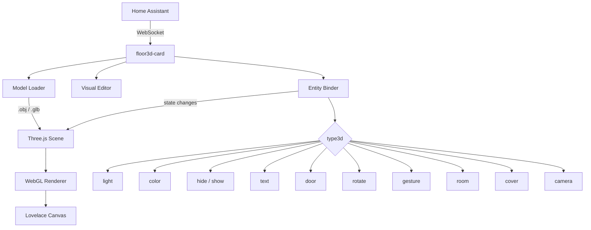
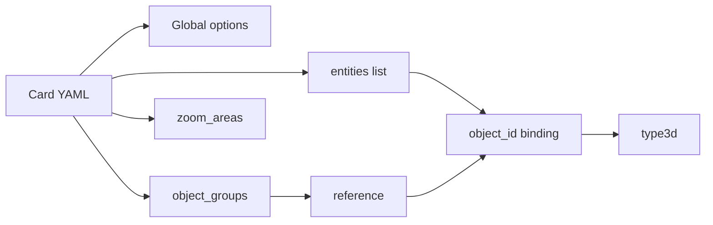
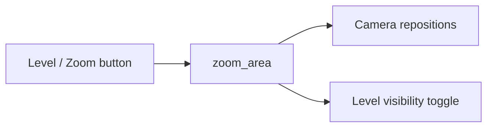

# new-floor3d-card — Home Assistant 3D Digital Twin

> Interactive 3D floor plan card for Home Assistant, powered by Three.js r138.
> Bind any entity state directly to objects in your 3D model.

---

## Architecture



---

## Installation

### HACS

Search for **floor3d** in the HACS Frontend section and install.

### Manual

Download `new-floor3d-card.js` from the [latest release](../../releases/latest) and place it in `/config/www/`.

Register the resource in Home Assistant:

```yaml
- url: /local/pathtofile/new-floor3d-card.js
  type: module
```

---

## 3D Model Preparation

### Supported formats

| Format | Extension | Notes |
|--------|-----------|-------|
| Wavefront | `.obj` + `.mtl` | Multi-file, widely supported |
| Binary GLTF | `.glb` | Single file, faster load |

### Export from SweetHome3D

1. Model your home and all objects in SweetHome3D.
2. Export via **3D View → Export to OBJ format**.
3. Copy the full output folder to `/config/www/<your-folder>/`.

### Convert OBJ → GLB (optional)

```bash
npm install -g obj2gltf
obj2gltf --checkTransparency -i home.obj -o home.glb
```

Place the resulting `.glb` in `/config/www/` — no `.mtl` or texture files needed.

---

## Card Configuration Flow



---

## Global Options

| Name | Type | Default | Description |
|------|------|---------|-------------|
| `type` | string | **Required** | `custom:floor3d-card` |
| `name` | string | `Floor 3d` | Card name |
| `path` | string | **Required** | Path to model files |
| `objfile` | string | **Required** | `.obj` or `.glb` filename |
| `mtlfile` | string | — | `.mtl` filename (OBJ format only) |
| `entities` | array | — | Entity bindings |
| `object_groups` | array | — | Named groups of objects |
| `zoom_areas` | array | — | Predefined camera zoom targets |
| `backgroundColor` | string | `#aaaaaa` | Canvas background (`#RGB`, color name or `transparent`) |
| `header` | string | `yes` | Show card header |
| `globalLightPower` | float | `0.5` | Global scene illumination intensity |
| `shadow` | string | `no` | `yes` to enable shadow casting |
| `extralightmode` | string | `no` | `yes` to limit shadow-casting lights to those currently on |
| `overlay` | string | `no` | `yes` to show the overlay info panel |
| `click` | string | `no` | `yes` to enable click events on objects |
| `lock_camera` | string | `no` | `yes` to disable zoom and rotate |
| `show_axes` | string | `no` | `yes` to show X/Y/Z axes in scene |
| `sky` | string | `no` | `yes` to render sky, ground and sun (uses `sun.sun` entity) |
| `north` | object | `{x:0, z:1}` | North direction vector on the X-Z plane (used with `sky: yes`) |
| `editModeNotifications` | string | `yes` | `no` to suppress double-click popups in edit mode |
| `selectionMode` | string | `no` | `yes` to enable multi-object selection (output to console) |
| `camera_position` | object | — | Saved camera position `{x, y, z}` |
| `camera_rotate` | object | — | Saved camera rotation `{x, y, z}` |
| `camera_target` | object | — | Saved camera target `{x, y, z}` |

### Camera position example

```yaml
camera_position:
  x: 100
  y: 200
  z: 300
camera_rotate:
  x: 0
  y: 0.5
  z: 0
camera_target:
  x: 0
  y: 0
  z: 0
```

> In edit mode, double-click on an empty space in the scene to retrieve the current camera coordinates.

---

## Entity Options

| Name | Type | Default | Description |
|------|------|---------|-------------|
| `entity` | string | **Required** | HA entity ID or `<object_group>` reference |
| `object_id` | string | **Required** | Object name in the 3D model |
| `type3d` | string | **Required** | Binding type (see below) |
| `entity_template` | string | — | JS template: `[[[ if ($entity > 25) { "hot" } ]]]` |
| `action` | string | — | Click action: `more-info`, `overlay`, `default` |

---

## type3d Reference

### `light`

Illuminates a point in the scene when the entity is `on`.

```yaml
- entity: light.living_room
  type3d: light
  object_id: lamp_bulb_1
  light:
    lumens: 900
    color: '#ffffff'
    decay: 1
    distance: 300
    shadow: 'yes'
    vertical_alignment: middle
    light_target: table_surface
```

### `color`

Changes object color based on entity state.

```yaml
- entity: binary_sensor.window
  type3d: color
  object_id: window_pane_50
  colorcondition:
    - state: 'on'
      color: '#00ff00'
    - state: 'off'
      color: '#ff0000'
```

### `hide` / `show`

Hides or shows an object when a condition is met.

```yaml
- entity: binary_sensor.motion
  type3d: hide
  object_id: presence_marker
  hide:
    state: 'off'
```

### `text`

Renders entity state as text on a plane object (TV screen, display, mirror).

```yaml
- entity: sensor.temperature
  type3d: text
  object_id: display_screen
  text:
    span: 50%
    font: verdana
    textbgcolor: '#000000'
    textfgcolor: '#ffffff'
    attribute: temperature
```

### `room`

Draws a highlighted parallelepiped over a room floor object.

```yaml
- entity: sensor.room_temp
  type3d: room
  object_id: room_floor_1
  room:
    elevation: 280
    transparency: 50
    color: '#0000ff'
    label: 'yes'
    span: 60%
    font: verdana
    textbgcolor: transparent
    textfgcolor: '#ffffff'
  colorcondition:
    - state: hot
      color: '#ff0000'
```

### `door`

Animates a door or window (swing or slide).

```yaml
- entity: binary_sensor.front_door
  type3d: door
  object_id: <FrontDoorGroup>
  door:
    doortype: swing
    side: left
    direction: inner
    degrees: '90'
    hinge: FrontDoor_hinge_1
    pane: FrontDoor_panel_1
```

| Parameter | Values | Description |
|-----------|--------|-------------|
| `doortype` | `swing`, `slide` | Animation type |
| `side` | `up`, `down`, `left`, `right` | Rotation axis border |
| `direction` | `inner`, `outer` | Rotation direction |
| `degrees` | number | Opening angle (swing) |
| `hinge` | object_id | Hinge pivot object |
| `pane` | object_id | Main moving panel |

### `cover`

Animates roller shutters and covers.

```yaml
- entity: cover.living_room_blind
  type3d: cover
  object_id: blind_group
  cover:
    pane: blind_slat_1
    side: up
```

### `rotate`

Continuously rotates an object when the entity is `on`.

```yaml
- entity: fan.ceiling
  type3d: rotate
  object_id: fan_blades
  rotate:
    axis: y
    round_per_seconds: 2
    hinge: fan_center
```

### `gesture`

Calls a HA service on double-click.

```yaml
- entity: switch.garden_pump
  type3d: gesture
  object_id: pump_body
  gesture:
    domain: switch
    service: toggle
```

### `camera`

Links a HA camera entity to a model object. Double-click shows the camera feed.

```yaml
- entity: camera.front_door
  type3d: camera
  object_id: camera_mount_1
```

---

## Object Groups

Group multiple model objects under a single name to apply entity bindings to all of them at once.

```yaml
object_groups:
  - object_group: ceiling_fan
    objects:
      - object_id: fan_blade_1
      - object_id: fan_blade_2
      - object_id: fan_blade_3
      - object_id: fan_motor

entities:
  - entity: fan.bedroom
    type3d: rotate
    object_id: <ceiling_fan>
    rotate:
      axis: y
      round_per_seconds: 3
```

---

## Zoom Areas



```yaml
zoom_areas:
  - zoom: Kitchen
    object_id: kitchen_floor
    rotation:
      x: -0.5
      y: 0
      z: 0
    direction:
      x: 0
      y: -1
      z: 0
    distance: 400
    level: 0
```

| Name | Type | Default | Description |
|------|------|---------|-------------|
| `zoom` | string | **Required** | Area name (shown on button) |
| `object_id` | string | **Required** | Target object in the model |
| `rotation` | object | `{x:0,y:0,z:0}` | Camera rotation toward area |
| `direction` | object | `{x:0,y:0,z:0}` | Camera direction vector |
| `distance` | number | `500` | Distance from target (cm) |
| `level` | number | — | Level index to isolate |

---

## Multi-Level Models

When using the SweetHome3D **ExportToHASS** plugin with a multi-level model, the card automatically renders level buttons at the top-left of the canvas. Click any level button to isolate that floor; click **All** to restore the full model.

---

## GPU Performance

For computers with discrete GPUs, the browser may default to the integrated GPU. Force the discrete GPU via:

- **Firefox** — NVIDIA Control Panel → High-performance GPU for Firefox; set `webgl.disable-angle = true` in `about:config`.
- **Chrome** — NVIDIA Control Panel → High-performance GPU for Chrome; set `chrome://flags/#use-angle` to OpenGL.
- **Edge** — same as Chrome via `edge://flags/#use-angle`.

---

## Full Configuration Example

```yaml
type: custom:floor3d-card
name: Ground Floor
path: /local/home/
objfile: home.glb
backgroundColor: transparent
globalLightPower: 0.4
shadow: 'yes'
overlay: 'yes'
click: 'yes'
camera_position:
  x: 0
  y: 500
  z: 800
object_groups:
  - object_group: living_lamp
    objects:
      - object_id: lamp_base_1
      - object_id: lamp_bulb_1
entities:
  - entity: light.living_room
    type3d: light
    object_id: <living_lamp>
    light:
      lumens: 800
      shadow: 'yes'
  - entity: sensor.temperature
    type3d: color
    object_id: thermostat_display
    colorcondition:
      - state: hot
        color: '#ff4444'
      - state: cool
        color: '#4444ff'
    entity_template: '[[[ if ($entity > 25) { "hot" } else { "cool" } ]]]'
  - entity: binary_sensor.front_door
    type3d: door
    object_id: door_front
    action: more-info
    door:
      doortype: swing
      side: left
      direction: inner
      degrees: '90'
```

---

## Build

```bash
npm install
npm run build      # lint + bundle
npm run start      # watch mode (dev)
```

Output: `dist/new-floor3d-card.js`

---

## License

MIT — see [LICENSE](LICENSE).
